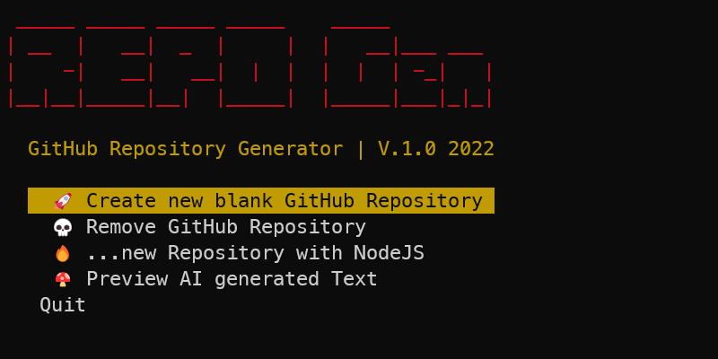

# Creating new repositories with AI
[](https://github.com/kori2000/telegram-bot/blob/main/LICENSE)
[](https://www.youtube.com/watch?v=QH2-TGUlwu4)

With this script generator you can create new fully automated repositories. The description of the project will be generated by keywords via an AI.



## Installation

Please adjust the template_data.yml file before the script.

```bash
# Replace .template_data.example.yml with 
# template_data.yml to proceed

# Settings
  app_name: # your-app-name
  app_keywords: # some keywords for AI
  server_port: # server port
  git_token: # your gitub token
  git_user: # your gituser name
  git_name: # your-app-name
  git_desc: # this can be manually added, or will be replaced from AI
  git_private: # true for private repo
  git_gitignore_template: # ignore templates from gitub, example: https://github.com/github/gitignore
  git_license_template: # license template from github, example: https://docs.github.com/en/rest/reference/licenses

```

- Generating new GitHub Token: https://github.com/settings/tokens/new
- GitHub Ignore Templates: https://github.com/github/gitignore
- GitHub License Templates: https://docs.github.com/en/rest/reference/licenses

## Starting

```bash

# 🚀 Start script with
$ ./create_repo.sh

```

## Contributing
Pull requests are welcome. For major changes, please open an issue first to discuss what you would like to change.

Please make sure to update tests as appropriate.

## License
[MIT](https://choosealicense.com/licenses/mit/)